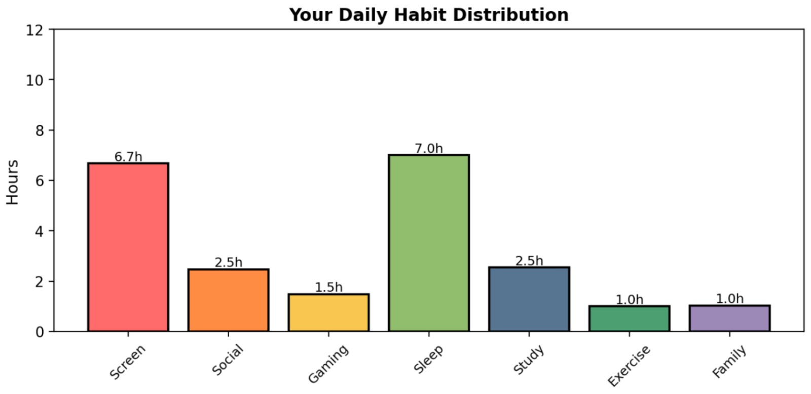
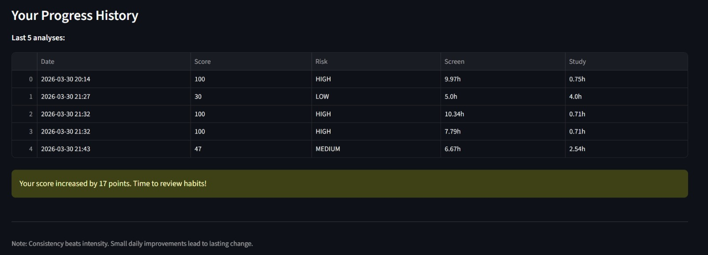

# ScreenSense-AI - Screenshots

## 1. Main Interface
The main dashboard where users input their daily habits.

---

## 2. Analysis Result - Score & Risk Level
Addiction score (0-100), risk level, and lifestyle rating.

---

## 3. Analysis Result - Issues/ What are you doing well/ Quick tips
It tells about the issue if risk level high and also tell us about what are you doing well and quick tips to improve.

---

## 4. Analysis Result - Personalized Suggestions
Actionable recommendations and give personalized suggestions.

---

## 5. Analysis Result - AI model prediction
It give the current score and target score and give predictions about it and also give us ideas to reach the target goal.

---

## 6. Habit Visualization
Bar chart comparing all 7 daily habits.

---

## 7. Progress History
Track improvement over time with saved analyses.

---

## How to View These Features

1. Clone the repository
2. Run the app: `streamlit run src/main.py`
3. Enter your daily habits
4. Click "Analyze My Digital Health"
5. Explore all sections!

---

*All screenshots taken from actual ScreenSense-AI application.*